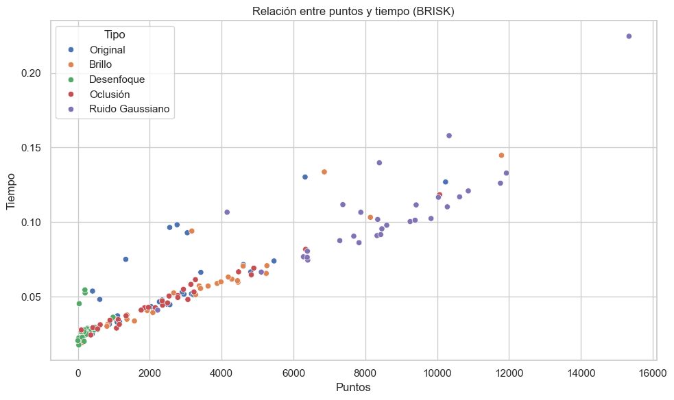

# Puntos de Interés calculados por diferentes metodos - Comparativa de tiempos
Detectores de puntos de interes, comparativa general de diferentes metodos para encontrar dichos puntos y el tiempo requerid.
Se adjunta imagen con el método brisk 

